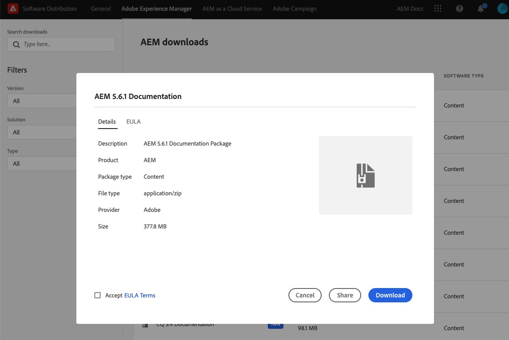

# Versioni precedenti di [!DNL Adobe Experience Manager], CQ e CRX {#older-versions-aem-cq-crx}

## Documentazione per le versioni precedenti di [!DNL Experience Manager] {#older-version-aem-documentation}

Le versioni di [!DNL Experience Manager], CQ e CRX elencate in questa pagina sono entrate nella fase “fine del ciclo di vita” e non sono più ufficialmente commercializzate da Adobe. Le ultime versioni della documentazione ufficiale per queste versioni precedenti sono comunque disponibili per gli utenti che possono averne bisogno. Consigliamo di effettuare l’aggiornamento alla versione più recente (attualmente [[!DNL Experience Manager] 6.5](https://experienceleague.adobe.com/docs/experience-manager-65.html?lang=it)).

>[!NOTE]
>
>Per sapere quando avrà termine il supporto di base per una versione di [!DNL Experience Manager], consulta [prodotti e periodi di supporto tecnico](https://helpx.adobe.com/it/support/programs/eol-matrix.html) e cerca `AEM`.

### Prima dell’installazione {#before-installation}

Prima di scaricare il pacchetto, verificare chi utilizzerà il contenuto. Questa decisione determinerà come verrà implementato:

* Gli sviluppatori possono eseguire una installazione locale per riferimento rapido.
* Per esigenze di documentazione aziendale più ampie, è consigliabile che il pacchetto venga implementato su un’istanza di AEM Author non di produzione accessibile internamente.

>[!NOTE]
>
>Gli utenti devono essere registrati nell’istanza di [!DNL Experience Manager] per accedere a questo contenuto in [!DNL Experience Manager] Author. Per impostazione predefinita questo contenuto non è accessibile in AEM Publish (in quanto esiste in /libs).

## Posizioni di Software Distribution {#software-distribution-locations}

Sarà necessario un Adobe ID valido:

* Se non disponi di un Adobe ID, puoi crearne uno all’indirizzo www.adobe.com
Per assistenza nella creazione o nella gestione dell’Adobe ID, [fai riferimento a questa guida](https://helpx.adobe.com/it/manage-account.html)

| Versione di [!DNL Experience Manager] | Collegamento per Software Distribution |
|:-----------:|:--------------------------------------------------:|
| [!DNL Experience Manager] 6.3 | [Scarica AEM-DOCS-6.3 da Software Distribution](https://experience.adobe.com/#/downloads/content/software-distribution/en/aem.html?package=/content/software-distribution/en/details.html/content/dam/aem/public/adobe/packages/aem-docs/aem-docs-6-3.zip) |
| [!DNL Experience Manager] 6.2 | [Scarica AEM-DOCS-6.2 da Software Distribution](https://experience.adobe.com/#/downloads/content/software-distribution/en/aem.html?package=/content/software-distribution/en/details.html/content/dam/aem/public/adobe/packages/aem-docs/aem-docs-6-2.zip) |
| [!DNL Experience Manager] 6.1 | [Scarica AEM-DOCS-6.1 da Software Distribution](https://experience.adobe.com/#/downloads/content/software-distribution/en/aem.html?package=/content/software-distribution/en/details.html/content/dam/aem/public/adobe/packages/aem-docs/aem-6-1.zip) |
| [!DNL Experience Manager] 6.0 | [Scarica AEM-DOCS-6.0 da Software Distribution](https://experience.adobe.com/#/downloads/content/software-distribution/en/aem.html?package=/content/software-distribution/en/details.html/content/dam/aem/public/adobe/packages/aem-docs/aem-docs-6-0.zip) |
| [!DNL Experience Manager] 5.6.1 | [Scarica AEM-DOCS-5.6.1 da Software Distribution](https://experience.adobe.com/#/downloads/content/software-distribution/en/aem.html?package=/content/software-distribution/en/details.html/content/dam/aem/public/adobe/packages/aem-docs/aem-docs-5-6-1.zip) |
| [!DNL Experience Manager] 5.6 | [Scarica AEM-DOCS-5.6 da Software Distribution](https://experience.adobe.com/#/downloads/content/software-distribution/en/aem.html?package=/content/software-distribution/en/details.html/content/dam/aem/public/adobe/packages/aem-docs/aem-docs-5-6.zip) |
| CQ 5.5 | [Scarica CQ-DOCS-5.5 da Software Distribution](https://experience.adobe.com/#/downloads/content/software-distribution/en/aem.html?package=%2Fcontent%2Fsoftware-distribution%2Fen%2Fdetails.html%2Fcontent%2Fdam%2Faem%2Fpublic%2Fadobe%2Fpackages%2Faem-docs%2Faem-docs-5-5.zip) |
| CQ 5.4 | [Scarica CQ-DOCS-5.4 da Software Distribution](https://experience.adobe.com/#/downloads/content/software-distribution/en/aem.html?package=/content/software-distribution/en/details.html/content/dam/aem/public/adobe/packages/aem-docs/aem-docs-5-4.zip) |
| CQ 5.3 | [Scarica CQ-DOCS-5.3 da Software Distribution](https://experience.adobe.com/#/downloads/content/software-distribution/en/aem.html?package=/content/software-distribution/en/details.html/content/dam/aem/public/adobe/packages/aem-docs/aem-docs-5-3.zip) |
| CRX 2.3 | [Scarica CRX-DOCS-2.3 da Software Distribution](https://experience.adobe.com/#/downloads/content/software-distribution/en/aem.html?package=/content/software-distribution/en/details.html/content/dam/aem/public/adobe/packages/aem-docs/crx-docs-2-3.zip) |
| CRX 2.2 | [Scarica CRX-DOCS-2.2 da Software Distribution](https://experience.adobe.com/#/downloads/content/software-distribution/en/aem.html?package=/content/software-distribution/en/details.html/content/dam/aem/public/adobe/packages/aem-docs/crx-docs-2-2.zip) |
| CRX 2.1 | [Scarica CRX-DOCS-2.1 da Software Distribution](https://experience.adobe.com/#/downloads/content/software-distribution/en/aem.html?package=/content/software-distribution/en/details.html/content/dam/aem/public/adobe/packages/aem-docs/crx-docs-2-1.zip) |
| CRX 2.0 | [Scarica CRX-DOCS-2.0 da Software Distribution](https://experience.adobe.com/#/downloads/content/software-distribution/en/aem.html?package=/content/software-distribution/en/details.html/content/dam/aem/public/adobe/packages/aem-docs/crx-docs-2-0.zip) |

## Come installare un pacchetto di documentazione {#how-to-install-documentation-package}

Per installare un pacchetto di documentazione di versioni precedenti è necessario che [!DNL Experience Manager] sia installato e funzionante sull’unità locale o di rete.

### Scaricare il pacchetto di documentazione {#download-documentation-package}

1. Dalla tabella precedente, seleziona il collegamento per la versione della documentazione di [!DNL Experience Manager] da scaricare. Ad esempio, AEM 5.6.1.

1. Effettua il login utilizzando il tuo Adobe ID. Se non disponi di un ID, creane uno.

1. Seleziona il pulsante **[!UICONTROL Download]**.

1. Esempio di ciò che verrà visualizzato:

### Installare il pacchetto nell’istanza locale {#install-package-local-instance}

>[!NOTE]
>
>Per AEM 6.2, potrebbe essere necessario avviare l’istanza locale aumentando la dimensione heap massima, ad esempio mediante questo comando: ` java -jar -XX:MaxPermSize=2048m aem-author.jar`

1. Apri l’interfaccia utente di [!DNL Experience Manager]. In un browser web immetti: `http://localhost:4502/`. Effettua l’accesso come Amministratore.

1. Seleziona **[!UICONTROL Strumenti]** > **[!UICONTROL Distribuzione]** > **[!UICONTROL Pacchetti]**.

1. Dall’interfaccia utente per la gestione dei pacchetti, seleziona **[!UICONTROL Carica pacchetto]**.

1. Individua il percorso in cui hai scaricato il pacchetto AEM.

1. Seleziona il pacchetto e fai clic su **[!UICONTROL OK]**.

1. Una volta che il pacchetto è stato caricato, sarà necessario installarlo.

1. Nell’interfaccia utente per la gestione dei pacchetti, individua il pacchetto e seleziona **[!UICONTROL Installa]**.

1. Nella finestra di dialogo di conferma, seleziona nuovamente **[!UICONTROL Installa]**. Nota: l’installazione richiederà alcuni minuti.

1. In un browser web, avvia la pagina della documentazione. Utilizzando l’esempio di AEM 5.6.1, l’URL sarà: http://localhost:4502/libs/aem-docs/content/en/cq/5-6-1.html.

## Chiedere aiuto alla community di [!DNL Experience Manager] {#get-help-from-aem-community}

In caso di domande sull’utilizzo di Experience Manager, ti consigliamo di [contattare i nostri esperti della community nei forum di [!DNL Experience Manager] ](https://experienceleaguecommunities.adobe.com/t5/adobe-experience-manager/ct-p/adobe-experience-manager-community).
